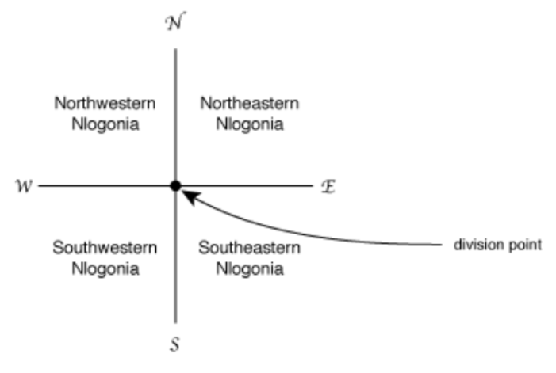
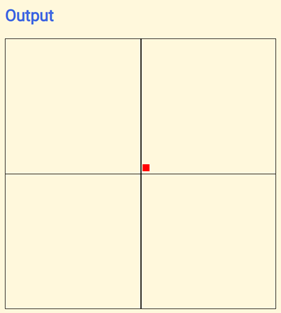
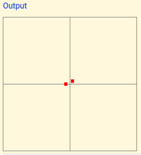

Q2 - Nlogonia (11498) - a debugging exercise
=============================================

After centuries of hostilities and skirmishes between the four nations living in the land generally known as Nlogonia, and years of negotiations involving diplomats, politicians and the armed forces of all interested parties, with mediation by UN, NATO, G7 and SBC, it was at last agreed by all the way to end the dispute, dividing the land into four independent territories.

It was agreed that one point, called division point, with coordinates established in the negotiations, would define the country division, in the following way. Two lines, both containing the division point, one in the North-South direction and one in the East-West direction, would be drawn on the map, dividing the land into four new countries. Starting from the Western-most, Northern-most quadrant, in clockwise direction, the new countries will be called Northwestern Nlogonia, Northeastern Nlogonia, Southeastern Nlogonia and Southwestern Nlogonia.

The UN determined that a page in the Internet should exist so that the inhabitants could check in which of the countries their homes are. You have been hired to help  implementing the system.

## Input

The first line of a test case contains two integers N and M representing the coordinates of the division point (−104 < N, M < 104 ).
This is followed by two integers X and Y representing the coordinates of a residence
(−104 ≤ X, Y ≤ 104 ).

## Output

For each test case in the input your program must place in the last table row the following:
*  the word ‘divisa’ (means border in Portuguese) if the residence is on one of the border lines
(North-South or East-West);
*  ‘NO’ (means NW in Portuguese) if the residence is in Northwestern Nlogonia;
*  ‘NE’ if the residence is in Northeastern Nlogonia;
*  ‘SE’ if the residence is in Southeastern Nlogonia;
*  ‘SO’ (means SW in Portuguese) if the residence is in Southwestern Nlogonia.

## Sample Input/ Output

| sample input | corresponding output  |
|---|---|
| 2 1 10 10 | NE |
| 2 1 -10 1 | divisa |
| 2 1 0 33 | NO |
| -1000 -1000 -1000 -1000 | divisa |
| -1000 -1000 0 0 | NE  |
| -1000 -1000 -2000 -10000 | SO  |
| -1000 -1000 -999 -1001 | SE |

and use the coordinate plane to plot the location as shown below:

for 2 1 10 10 inputs

combined with 2 1 -10 1 as inputs as well

## Requirements
1. Can work alone or with a partner. If with a partner, please indicate the their name when submitting.
2. Change the html title and the meta author to contain your name/s.
3. All the HTML, CSS and java script is finished but with errors incorporated in both CSS and JavaScript.
4. Identify the 10 errors and using the **`errorlogs.html`**, identify where they are found in terms of code line number and in what part (CSS or JS) and also describe how they were corrected by you.
5. Learn on your own part: Research on the following:
   - HTML DOM Methods createElement, appendChild
   - HTML DOM attribute className
   - image sprites

## Topics implemented in this requirement
1. CSS position
2. text links
3. image sprites
4. JS events and functions
5. JS manipulation of HTML Elements and CSS Properties

---
